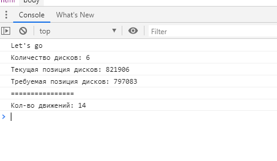
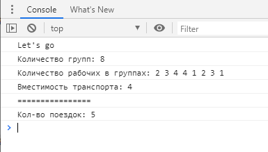
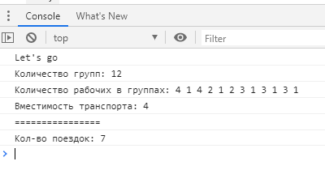

# Результаты выполнения тестового задания JavaScript
Задания были исполнены в браузере Google Chrome версии 80.0.3987.162.  

Результаты выполнения задания выводятся в консоль браузера. Входные параметры также прописаны непосредственно в *.js коде.
## Задание №1
Существует некий замок с n вращающихся дисков. На каждом диске написаны цифры с 0 до 9. Чтобы открыть замок нужно поворачивать диски до тех пор, пока они не образуют секретную комбинацию. Существует только одна секретная комбинация. За одно действие можно прокрутить только один диск и только на одну цифру вперед или назад. Требуется посчитать минимальное кол-во действие, для того, чтобы открыть замок.

Файл запуска JS скрипта: [task1.html](task1.html)  
Параметры задачи записаны в файле [task1.js](task1.js)
```
// =============== put task params here =============== //
var diskCou = 6;
var curPositions = 821906;
var secretPositions = 797083;
// =============== put task params here =============== //
```
Начальные и конечные позиции вращающихся дисков задаются десятичными числами. Т.к. это JS, то кол-во дисков задаётся в переменной ```diskCou```. Первые диски с нулевыми значениями указывать не надо, чтобы JS не воспринял это значение как восмеричное число.

Пример: Вместо: ```var curPositions = 000124``` следует писать: ```var curPositions = 124``` начальние нули скрипт доставит руководствуясь значением переменной ```diskCou```.

Код, непосредственно выполняющий задачу:
```
var moveCounter = 0;
for (var cou = 1; cou <= diskCou; cou++) {
	moveCounter += getClickCou(curPositions % 10, secretPositions % 10);
	curPositions = curPositions / 10 | 0;
	secretPositions = secretPositions / 10 | 0;
}
```

Остальной код выполняет проверку граничных условий.
Результат работы скрипта:  


## Задание №2
Имеется n групп рабочих. Каждая группа состоит из s (1 ≤ si ≤ 4) рабочих. Необходимо перевезти на строительный объект все группы рабочих на машинах. Каждая машина может перевезти только 4х рабочих, при этом группы делить нельзя, каждую группы нужно перевезти целиком. Требуется посчитать минимальное количество машин необходимых для перевозки рабочих. 

Файл запуска JS скрипта: [task2.html](task2.html)  
Параметры задачи записаны в файле [task2.js](task2.js)
```
// =============== put task params here =============== //
var groupsCount = 12;
var groupsQty = "4 1 4 2 1 2 3 1 3 1 3 1";
// =============== put task params here =============== //
```
Вместимость машины задаётся константой ```const CAR_CAPACITY = 4;```

Код, непосредственно выполняющий задачу:
```
var sendedTransport = 0;
var restVal = CAR_CAPACITY;
while (groupsQtyArr.length > 0) {
	while(restVal > 0 && groupsQtyArr.length > 0) {
		var reduceVal = getMaxGroup(restVal, groupsQtyArr);
		restVal -= reduceVal;
		groupsQtyArr = removeElemByVal(reduceVal, groupsQtyArr)
	}
	sendedTransport += 1;
	restVal = CAR_CAPACITY;
}
```

Остальной код выполняет проверку граничных условий и описывает вспомогательные функции. 

Для входящих параметров:  
```
const CAR_CAPACITY = 4;

// =============== put task params here =============== //
var groupsCount = 8;
var groupsQty = "2 3 4 4 1 2 3 1";
// =============== put task params here =============== //
```
Результат работы скрипта:  


Для входящих параметров:  
```
const CAR_CAPACITY = 4;

// =============== put task params here =============== //
var groupsCount = 12;
var groupsQty = "4 1 4 2 1 2 3 1 3 1 3 1";
// =============== put task params here =============== //
```
Результат работы скрипта:  
